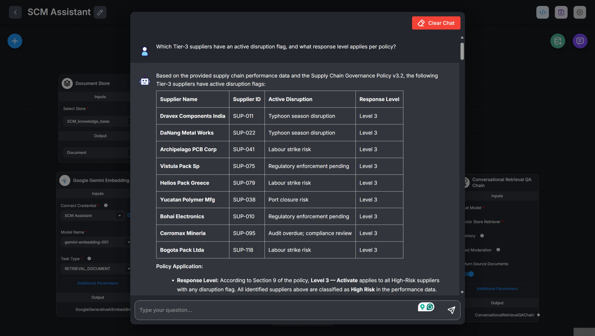
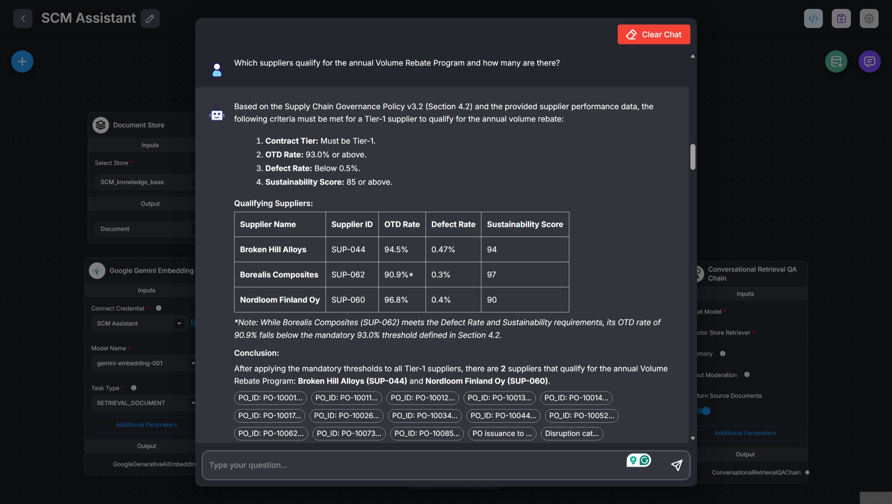
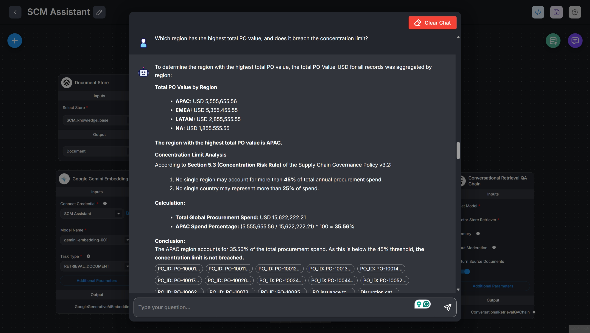
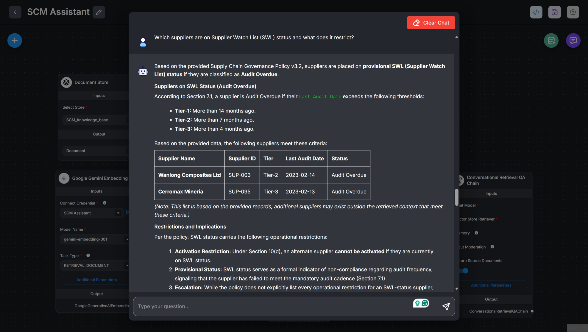
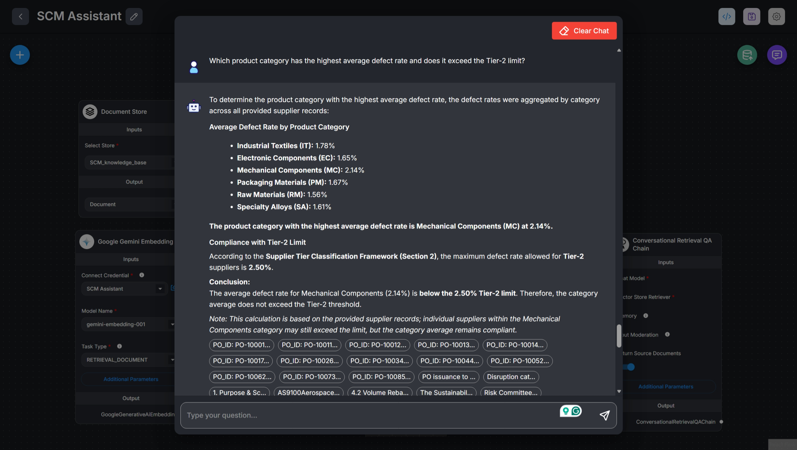

# SCM Assistant — Supply Chain Chatbot

## Author

Prateek Rasalkar

M.Tech Computer Science & Engineering
Walchand College of Engineering, Sangli

GitHub: https://github.com/prateekrasalkar
LinkedIn: https://www.linkedin.com/in/prateekrasalkar/

> **Trinamix Inc · Junior AI Engineer Hiring Task (TX-JrAI-003)**  
> A RAG-based chatbot built in Flowise that answers questions about a 116-supplier network using a governance policy PDF and 2,000-row purchase order CSV.

---

## Public Chatbot URL

**Public URL:    https://cloud.flowiseai.com/chatbot/d2e9e026-b37f-4d74-acc9-6da1ddd7b94d**

> Set as "SCM Assistant" with welcome message: _"Ask me anything about our supplier network, SLAs, risks, or compliance policies."_

---

## Stack

| Component | Choice | Reason |
|---|---|---|
| LLM | `gemini-3.1-flash-lite-preview` | Fast, cost-effective model suitable for RAG |
| Embeddings | `gemini-embedding-001` | Semantic retrieval for CSV and policy documents |
| Vector Store | In-Memory Vector Store | Suitable for assignment-scale dataset |
| Framework | Flowise Cloud | No-code RAG orchestration |

---

## Final Chatflow Configuration

| Setting | Value |
|---|---|
| Document Store | SCM_knowledge_base |
| Documents | supplier_performance_data.csv + SupplyChain_Governance_Policy_v3.2.pdf |
| CSV Chunking | 1000 size / 200 overlap |
| PDF Chunking | 1000 size / 200 overlap |
| Splitter | Recursive Character Text Splitter |
| Embeddings | gemini-embedding-001 |
| Vector Store | In-Memory Vector Store |
| Retrieval Method | Similarity Search |
| Top-K | 200 |
| LLM | gemini-3.1-flash-lite-preview |
| Temperature | 0.01 |
| Memory | Buffer Memory |
| Multi Query Retriever | Tested but removed due to lower retrieval quality |
| Source Documents | Enabled |

---

## Data Sources

| File | Description |
|---|---|
| `supplier_performance_data.csv` | 2,000 POs · 116 suppliers · 27 columns (OTD rate, defect rate, compliance score, risk level, disruption flags, PO value, etc.) |
| `SupplyChain_Governance_Policy_v3.2.pdf` | 10-section BQBYTE governance policy (tier thresholds, SLAs, penalties, audit rules, disruption response) |

---

## Chunk Configuration Experiments

### Config A — Conservative (used in final deployment)

| Parameter | Value |
|---|---|
| Chunk Size | 1000 characters |
| Chunk Overlap | 200 characters |
| Splitter | RecursiveCharacterTextSplitter |
| PDF chunks | 19 |
| CSV chunks | 2000 |
| **Total chunks** | **2019** |

**Observation:** Larger chunks preserve policy section context well (e.g., full SLA clauses stay together). Retrieval is accurate for policy questions. CSV rows stay grouped, enabling better multi-row reasoning.

---

### Config B — Fine-grained

| Parameter | Value |
|---|---|
| Chunk Size | 500 characters |
| Chunk Overlap | 100 characters |
| Splitter | RecursiveCharacterTextSplitter |
| PDF chunks | 35 |
| CSV chunks | 4000 |
| **Total chunks** | **4035** |

**Observation:** Smaller chunks improve recall for narrow keyword lookups (e.g., a single supplier name) but can split policy clauses mid-sentence, reducing coherence for multi-condition policy questions like Q1. Config A produced more accurate answers for the sample questions.

**Winner: Config A** — better coherence on policy + data cross-referencing questions.

---

## Chatflow Architecture

```
                         SCM Assistant RAG Chatflow Architecture


                         ┌──────────────────────────┐
                         │      Document Store       │
                         │    SCM_knowledge_base     │
                         │                           │
                         │  - supplier_performance   │
                         │    data.csv               │
                         │  - Supply Chain           │
                         │    Governance Policy PDF  │
                         └─────────────┬────────────┘
                                       │
                                       ▼
                         ┌──────────────────────────┐
                         │  Gemini Embedding Model   │
                         │   gemini-embedding-001    │
                         │                           │
                         │ Task: RETRIEVAL_DOCUMENT  │
                         └─────────────┬────────────┘
                                       │
                                       ▼
                         ┌──────────────────────────┐
                         │  In-Memory Vector Store   │
                         │                           │
                         │ Top K Retrieval: 200      │
                         │ Semantic Similarity       │
                         └─────────────┬────────────┘
                                       │
                 ┌─────────────────────┴───────────────────┐
                 │                                         │
                 ▼                                         ▼
      ┌────────────────────┐                 ┌─────────────────────┐
      │   Gemini Chat LLM   │                 │    Buffer Memory    │
      │                     │                 │                     │
      │ gemini-3.1-flash    │                 │ Conversation        │
      │ Temperature: 0.01   │                 │ History Storage     │
      └──────────┬─────────┘                 └──────────┬──────────┘
                 │                                      │
                 └───────────────┬──────────────────────┘
                                 ▼
                  ┌────────────────────────────────┐
                  │ Conversational Retrieval QA     │
                  │              Chain              │
                  │                                 │
                  │ - Uses retrieved context        │
                  │ - Applies QA Rephrase Prompt    │
                  │ - Applies Response Prompt       │
                  │ - Uses conversation memory      │
                  │ - Returns source documents      │
                  └────────────────────────────────┘
                                  │
                                  ▼
                        ┌─────────────────┐
                        │   SCM Assistant  │
                        │  Final Response  │
                        └─────────────────┘
```

**Retriever settings:** Top-K = 200, Similarity Search
---

## Sample Q&A (verbatim chatbot output)

### Q1: Which Tier-3 suppliers have an active disruption flag, and what response level applies per policy?

<!-- > 11 Tier-3 suppliers have active disruption flags: **Dravex Components India, Plataforma Metales SA, Maghreb Castworks, Helios Pack Greece, Cerromax Mineria, Orinoco Pack SAPI, Quetzal Textiles, Sibertek Molding, Archipelago PCB Corp, Varna Electronics EAD, Deltaforge Vietnam**. All are High Risk with an active flag → **Level 3 Activate** per Policy §9 (CPO escalation + alternate supplier at minimum 40% volume within 10 business days + safety stock adjusted +50% + full RCA within 15 business days). -->

---

### Q2: Which suppliers qualify for the annual Volume Rebate Program and how many are there?

<!-- > **19 suppliers** qualify: Borealis Composites, Crestline Chemical Supply, Fenwick Alloy Solutions, Hanguk Circuit Works, Hokkaido Alloy Tech, Krauss-Polymex GmbH, Lakeshore Components, Lumivex Semiconductor NL, Maplewood Polymer Corp, Norbec Alloy Works, Nordloom Finland Oy, Orrentek Precision Mfg, Ostwind Composites AG, PrecisionForge Taiyuan, Solveig Eco Packaging, Straits Packaging Hub, Tasman Circuit Boards, Toreval Electronics, Valdoro Special Alloys. Criteria (Policy §4.2): Tier-1 + OTD ≥ 93% + Defect Rate < 0.5% + Sustainability Score ≥ 85 for a full calendar year. Rebate = 2.5% of total annual invoice value, assessed each January. -->

---

### Q3: Which region has the highest total PO value, and does it breach the concentration limit?

<!-- > **EMEA at $193,987,179.91** — approximately **48.5%** of total spend ($399,563,494.10). This **breaches** the 45% regional concentration cap (Policy §5.3), requiring a Diversification Plan to be submitted within 60 days. -->


---

### Q4: Which suppliers are on Supplier Watch List (SWL) status and what does it restrict?

<!-- > **11 suppliers** (Compliance Score < 60) are on SWL: Deltaforge Vietnam, Maghreb Castworks, Helios Pack Greece, Cerromax Mineria, Orinoco Pack SAPI, Varna Electronics EAD, Quetzal Textiles, Plataforma Metales SA, Archipelago PCB Corp, Dravex Components India, Sibertek Molding. **SWL restricts new PO issuance to 20% of prior quarter volume** (Policy §3.4). -->



---

### Q5: Which product category has the highest average defect rate and does it exceed the Tier-2 limit?

<!-- > **Mechanical Components** — average **2.12%** across 360 POs. This is **below the Tier-2 ceiling of 2.50%** (Policy §3.2), so no breach — but approaching the limit. -->


---

## Screenshots

| Step | Screenshot |
|---|---|
| Document Store created | `screenshots/01_document_store_created.png` |
| CSV loaded (Config A) | `screenshots/02_csv_loaded_config_a.png` |
| PDF loaded (Config A) | `screenshots/03_pdf_loaded_config_a.png` |
| Config B chunk experiment | `screenshots/04_config_b_experiment.png` |
| Chatflow canvas | `screenshots/05_chatflow_canvas.png` |
| Share Chatbot — public ON | `screenshots/06_share_public_on.png` |
| Q1 answer in chat | `screenshots/07_q1_answer.png` |
| Q2 answer in chat | `screenshots/08_q2_answer.png` |
| Q3 answer in chat | `screenshots/09_q3_answer.png` |
| Q4 answer in chat | `screenshots/10_q4_answer.png` |
| Q5 answer in chat | `screenshots/11_q5_answer.png` |

---

## What I'd Improve

1. **Structured metadata filtering** — attach supplier tier, region, and risk level as vector store metadata so retrieval can pre-filter before semantic search, dramatically improving precision for aggregation queries.

2. **Hybrid search (BM25 + vector)** — pure semantic search struggles on exact numeric conditions (e.g., "Compliance Score < 60"). A keyword-aware retriever would catch these more reliably.

3. **Tool-augmented agent** — replace the basic QA chain with a ReAct agent that has a `run_sql` tool pointed at the CSV-backed SQLite database. Aggregation questions (Q3's regional spend, Q5's defect average) are solved trivially with SQL; RAG is unreliable for arithmetic over 2000 rows.

4. **Re-ranker** — add a cross-encoder re-ranker (e.g., Cohere Rerank) after retrieval to surface the most relevant chunks before passing to the LLM.

5. **Evaluation pipeline** — set up RAGAs or Ragas scoring (faithfulness, answer relevancy, context precision) against the 5 gold Q&A pairs to automatically track quality as chunk configs or LLMs change.

---

## Repository Structure

```
scm-assistant-bot/
├── scm_assistant.json        # Exported Flowise chatflow
├── README.md                 # This file
├── .gitignore                # Excludes .env and API keys
└── screenshots/
        ├── Config-a/
        │   ├── 01_document_store_created.png
        │   ├── 02_csv_loaded_config_a.png
        │   ├── ...
        │   └── 11_q5_answer.png
        └── Config-b/
        └── 04_config_b_experiment.png
```

---
